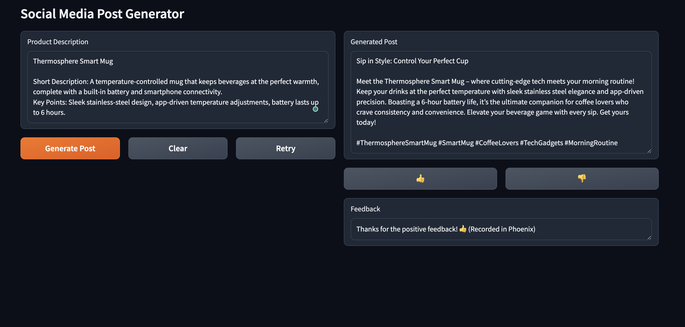
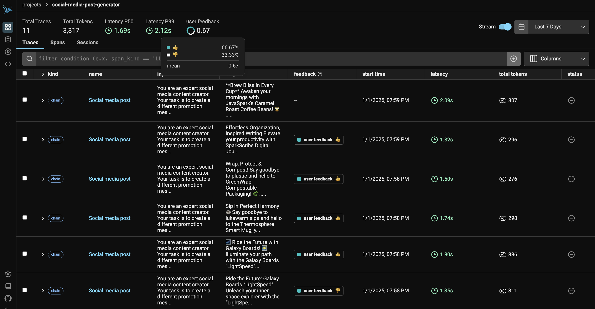

# Social Media Post Generator with User Feedback

A demonstration of Phoenix's human annotation feature through a practical social media post generator application. The app allows users to generate social media posts and provide feedback, which is captured and analyzed using Phoenix's tracing capabilities.

Screenshot of the WebApp:


Watch the Video Tutorial 🎥: <br>
[](https://youtu.be/5RCWtzBbq9E)

[Using Annotations to Collect Human Feedback from Your LLM App in Phoenix](https://www.youtube.com/watch?v=7eiQbz7_7H4)

Read the Medium Post ✍️<br>
[Enhance LLM Evaluation and Fine-Tuning with Phoenix Human Annotations](https://medium.com/p/9e10282ab687)


## Features

- 🤖 AI-powered social media post generation
- 👍👎 Real-time user feedback collection
- 📊 Feedback analysis through Phoenix traces
- 🔄 Retry functionality for better results
- 📱 Clean, user-friendly interface

## Why Use Phoenix Annotations?

Phoenix's human annotation feature allows you to:
- Collect and analyze user feedback at scale
- Track user satisfaction over time
- Make data-driven improvements to your LLM applications
- Create datasets of successful/unsuccessful generations
- Share insights within your team

Screenshot of how Phoenix dashboard looks like:


## Prerequisites

- Python 3.8+
- OpenAI API key
- Phoenix (local instance or cloud account)

## Installation

1. Clone the repository:

    ```bash
    git clone https://github.com/yourusername/social-media-post-generator.git
    cd social-media-post-generator
    ```

2. Install dependencies:

    ```bash
    pip install arize-phoenix openai openinference-instrumentation-openai gradio 'httpx<0.28'
    ```

3. Set up environment variables:

    ```bash
    export OPENAI_API_KEY='your-openai-api-key'
    ```

    If using Phoenix cloud (optional):

    ```bash
    export PHOENIX_API_KEY='your-phoenix-api-key'
    ```

## Running the Application

1. Start the application:

    ```bash
    python social_media_post_generator.py
    ```

2. Open your browser and navigate to `http://localhost:7860`.

3. Enter a product description and click "Generate Post".

4. Provide feedback using the 👍 or 👎 buttons.

## Tutorial

For a detailed walkthrough, check out the [Tutorial notebook](Tutorial_notebook.ipynb), which covers:
1. Setting up Phoenix and OpenAI.
2. Creating a post generator function.
3. Implementing a feedback mechanism.
4. Testing the system.
5. Analyzing feedback in Phoenix.

## How It Works

1. **Post Generation**: The application uses GPT-4 to generate social media posts based on product descriptions.

2. **Tracing**: Each generation is traced using Phoenix's OpenTelemetry integration:

    ```python
    with tracer.start_as_current_span("Social media post") as span:
        span.set_attribute(SpanAttributes.INPUT_VALUE, description)
        # ... generation logic ...
        span.set_attribute(SpanAttributes.OUTPUT_VALUE, output_content)
    ```

3. **Feedback Collection**: User feedback is captured and sent to Phoenix:

    ```python
    annotation_payload = {
        "data": [{
            "span_id": span_id,
            "name": "user feedback",
            "annotator_kind": "HUMAN",
            "result": {
                "label": "👍" if feedback_type == "like" else "👎",
                "score": 1 if feedback_type == "like" else 0,
            }
        }]
    }
    ```

## Analyzing Results

1. Open your Phoenix dashboard.
2. Navigate to the Traces view.
3. Look for traces with the name "Social media post".
4. Click on a trace to see:
   - Input product description.
   - Generated content.
   - User feedback (👍 or 👎).
   - Timing information.

## Contributing

Contributions are welcome! Please feel free to submit a Pull Request.
